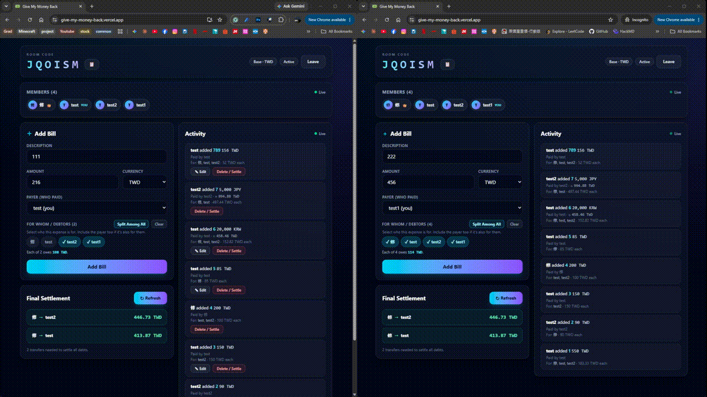
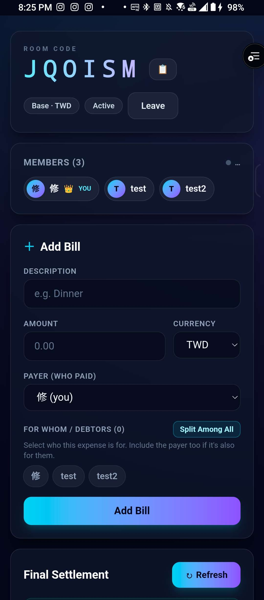
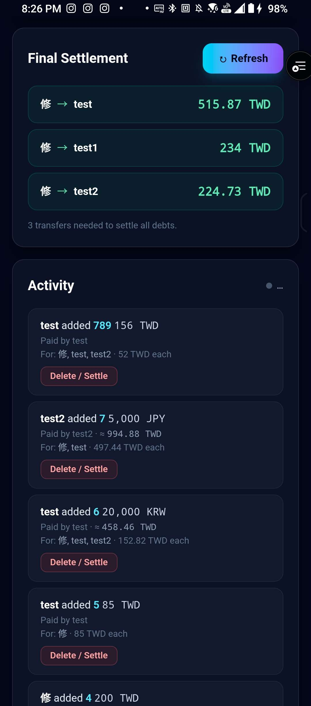

# Give My Money Back · 多人即時共用記帳系統

A login-free, real-time shared expense tracker for splitting bills among friends on trips or
group meals — **Kahoot-style**. No registration required: create a room or enter a **room code**
to join, pick a nickname, and start tracking. When the activity ends, the system computes the
minimum set of repayments needed to settle up.

**Demo link: [give-my-money-back](https://give-my-money-back.vercel.app)** —
open it on two devices, join the same room code, and watch them stay in sync.

## Why I built this

Every trip with friends ended the same way: a chaotic group chat at the end of the night, someone
scrolling back through receipts, and a lot of "wait, who paid for the taxi?". Existing apps all
wanted everyone to sign up first — which nobody does at 2 a.m. in a hotel lobby.

So the design constraint came first: **zero friction to join, and nobody can quietly change the
numbers.** That single constraint drove most of the interesting engineering here — the
header-token identity model instead of accounts, the two-party confirmation before any bill
disappears, and storing both the original and converted amounts so a later exchange-rate move
can't silently rewrite what someone owes.

## Demo

**Real-time sync across devices** — two browsers in the same room. A bill added on one side shows
up on the other instantly, and the settlement plan updates along with it.



| Room & bill entry | Settlement & activity feed |
| :---: | :---: |
|  |  |

## Features

- **No-login rooms** — Join with a room code. A per-device UUID is stored in `localStorage` as
  your identity token, so refreshing or reopening the browser automatically reclaims your
  nickname and history.
- **Shared bill entry** — Every member can add bills. Only the bill's creator can edit it later.
- **Two-party bill removal** — Bills are never hard-deleted. Removing one is a negotiation:
  a participant requests it (`active → pending_delete`), and a *different* participant must
  confirm before it becomes `deleted` — so nobody can quietly erase what they owe.
- **Multi-currency** — Set a base currency per room (e.g. TWD). Bills can be entered in other
  currencies (JPY, USD, …); the original amount and the converted base amount are both stored so
  later exchange-rate drift doesn't affect settlement.
- **Debt simplification** — A greedy heap-based algorithm minimizes the number of transactions
  (e.g. *A owes B 100, B owes C 100* → *A pays C 100*). The plan updates automatically as bills
  change.
- **Realtime sync + action log** — Powered by Supabase Realtime. All members see live updates and
  a running activity feed ("Ming added Dinner $500", "Hua confirmed Ming's repayment").
- **PWA** — Installable on mobile via `vite-plugin-pwa`.

## Tech Stack

| Layer      | Technology                                        |
| ---------- | ------------------------------------------------- |
| Frontend   | React 19, TypeScript, Vite 6, Tailwind CSS 4      |
| Backend    | Supabase (PostgreSQL, Realtime, Edge Functions)   |
| PWA        | vite-plugin-pwa                                    |
| Deployment | Vercel (frontend) + Supabase cloud (database)     |

## Project Structure

```
src/
  components/      UI: Home, RoomDashboard, AddBillForm, BillFeed, SettlementPanel
  hooks/           useAuth, useRoomBills, useRoomMembers
  lib/             supabaseClient, roomApi, billApi, exchangeRate, deviceToken
  types.ts         shared types
supabase/
  migrations/      SQL schema, RLS policies, RPCs
  functions/       Edge Functions (optimize-debts + tests)
scripts/           generate-pwa-icons.mjs
```

## Getting Started

### Prerequisites

- Node.js 18+
- A Supabase project ([supabase.com](https://supabase.com))

### Setup

1. Install dependencies:

   ```bash
   npm install
   ```

2. Configure environment variables — copy the example and fill in your Supabase values:

   ```bash
   cp .env.example .env.local
   ```

   ```env
   VITE_SUPABASE_URL=https://your-project.supabase.co
   VITE_SUPABASE_ANON_KEY=your-anon-key
   ```

3. Apply the database schema and deploy functions (requires the
   [Supabase CLI](https://supabase.com/docs/guides/cli)):

   ```bash
   supabase db push
   supabase functions deploy optimize-debts
   ```

### Scripts

| Command           | Description                              |
| ----------------- | ---------------------------------------- |
| `npm run dev`     | Start the Vite dev server                |
| `npm run build`   | Type-check (`tsc -b`) and build for prod |
| `npm run preview` | Preview the production build locally     |
| `npm test`        | Run the debt-simplification unit tests (needs [Deno](https://deno.com)) |

### Deployment

The live demo runs on **Vercel** (static frontend, auto-deployed from `main`) backed by a hosted
**Supabase** project. To deploy your own copy:

1. Push the repo to GitHub and import it in Vercel — the Vite preset needs no extra config
   (build `npm run build`, output `dist`).
2. Add `VITE_SUPABASE_URL` and `VITE_SUPABASE_ANON_KEY` as Vercel environment variables.
   Both are safe to ship to the browser; all real authorization lives in the RLS policies.
3. Point the Supabase CLI at your project and run the `supabase db push` /
   `supabase functions deploy` steps above.

## Database

Schema, Row Level Security policies, and RPCs live in `supabase/migrations/`. RLS leverages the
client-side UUID to enforce that **only a bill's creator can edit it** and **only the host can
close a room**. Rooms idle for ~1 month are archived automatically.

The debt-simplification logic is implemented as a Supabase Edge Function in
`supabase/functions/optimize-debts/`, with unit tests in `simplify.test.ts`.

## Design notes & trade-offs

The decisions I'd most want to talk through:

**Identity without accounts.** Each browser generates a UUID into `localStorage` and sends it as an
`x-user-token` header. PostgREST exposes request headers to Postgres, so RLS policies read that
token directly — write permissions ("only the creator edits a bill", "only the host closes a
room") are enforced *in the database*, not in the client. See `app_current_token()` in
`supabase/migrations/00001_init.sql`.

**Where that model breaks, and what I did about it.** Supabase Realtime evaluates RLS over a
websocket, where the HTTP header doesn't exist — so my member-scoped read policies silently
delivered zero events. I traded read privacy for working realtime: rows are publicly selectable,
but `users.token` is revoked at the *column* level so the credential can never be read back, and
every write policy stays header-gated. The reasoning and the migration path (Supabase Anonymous
Auth + `realtime.setAuth()`) are written up in `00002_realtime_and_room_rpcs.sql`.

**Money is never floating point.** Balances are computed in integer minor units, and each bill's
shares are distributed with the largest-remainder method so they sum to the bill total *exactly*.
A room's balances therefore always sum to zero, no matter how the cents divide.

**Deleting is a negotiation, not a button.** Any participant can request a delete; a *different*
participant must confirm it. Bills are only ever soft-deleted, so the ledger stays auditable —
important when the whole point is that nobody can quietly edit what they owe.

**Greedy, not optimal — on purpose.** Minimizing the number of transfers exactly is NP-hard (it
reduces to subset-sum). The biggest-debtor-vs-biggest-creditor greedy runs in O(n log n), never
needs more than n−1 transfers, and is optimal for the shapes that actually occur on a trip.

## What's next

- **Repayment confirmation UI.** The `debts` table already implements an
  `unpaid → pending_confirm → settled` state machine, guarded by a Postgres trigger that rejects
  illegal transitions (`00001_init.sql`) — the debtor marks "I paid", the creditor confirms
  "I received", and the creditor can bounce it back. The schema and triggers are done; the
  frontend for it isn't built yet, so today the settlement plan is advisory.
- **Real auth for private rooms.** Swapping the header token for Supabase Anonymous Auth would let
  the member-scoped read policies work over Realtime too (see the trade-off above).
- **Exchange-rate caching.** Rates are fetched per bill submission; a short-lived cache would cut
  latency and make bill entry work offline-ish.
